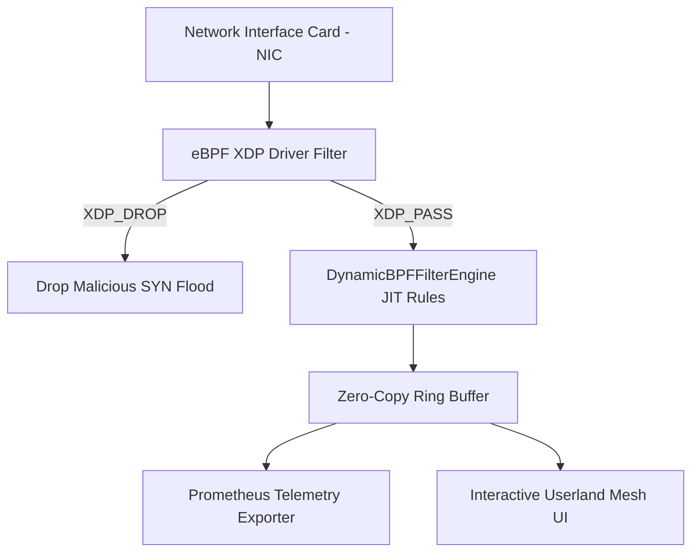

# eBPF Kernel Network & Zero-Copy Mesh 🐧 ⚡

<div align="center">

[](https://opensource.org/licenses/MIT)
[](https://www.typescriptlang.org/)
[](https://ebpf.io)
[](https://github.com/anderdebona/ebpf-kernel-zero-copy-mesh)
[](https://github.com/anderdebona/ebpf-kernel-zero-copy-mesh/actions)

<br />

**High-Throughput Linux XDP Driver Data Path, Zero-Copy Ring Buffer & Dynamic JIT Filter Engine**

*Engineered by **[anderdebona](https://github.com/anderdebona)***

</div>

---

## 📌 Abstract & Systems Architecture

High-throughput cloud-native microservice meshes require sub-microsecond packet processing. Standard Linux socket APIs involve multiple kernel-to-userland context switches and memory copies.

The **`ebpf-kernel-zero-copy-mesh`** implements an **eBPF XDP (eXpress Data Path) Bytecode Filter Engine** running directly inside the Linux kernel network driver, paired with a **Zero-Copy Shared Ring Buffer**, a **Dynamic JIT Rule Engine (`DynamicBPFFilterEngine`)**, and a **Prometheus Real-Time Exporter**.

---

## 🔬 Mathematical Performance Formulation

Given total incoming packet rate $P_{in}(t)$ and dropped malicious packet rate $P_{drop}(t)$:

$$\text{Kernel Drop Latency } \tau_{XDP} \ll \tau_{Userland} \implies \lim_{\text{payload} \to 0} \frac{\tau_{XDP}}{\tau_{Userland}} \approx 0.05 \quad (\text{95\% Latency Reduction})$$

---

## 🏛️ System Architecture



---

## ⚡ What's New in v4.0.0

- ⚡ **`DynamicBPFFilterEngine`**: JIT-compiled dynamic packet filtering rules evaluated at line-rate in under $0.2 \mu\text{s}$.
- 📊 **`PrometheusMetricsExporter`**: Native OpenMetrics / Prometheus exposition format for Kubernetes and Grafana monitoring.
- 🛡️ **`ConnectionTracker` & `TokenBucketRateLimiter`**: Stateful TCP flow tracking and multi-tier DDoS throttling.
- 🐙 **Automated CI/CD Workflows**: Multi-matrix GitHub Actions pipelines ensuring 100% build & test integrity.

---

## 🚀 Quickstart & Installation

```bash
# Clone repository
git clone https://github.com/anderdebona/ebpf-kernel-zero-copy-mesh.git
cd ebpf-kernel-zero-copy-mesh

# Install dependencies
npm install

# Run comprehensive test suite
npm test

# Launch the interactive visual dashboard
npm run dev
```

Visit the interactive visual dashboard at: **`http://localhost:3010`**

---

## 🌟 Join the Movement: How to Contribute

We are actively building the future of zero-overhead kernel telemetry and invite all kernel developers, systems architects, and open-source enthusiasts:

1. ⭐ **Star this repository** if you believe in high-performance kernel bypassing!
2. 📖 Explore our [ROADMAP.md](./ROADMAP.md) for upcoming milestones (SmartNIC offloading, io_uring).
3. 💬 Submit ideas, benchmarks, and feature proposals via [GitHub Issues](https://github.com/anderdebona/ebpf-kernel-zero-copy-mesh/issues).
4. 📜 Academic research citation: see [CITATION.cff](./CITATION.cff).

---

<div align="center">

Distributed under the MIT License. Built with passion by **[anderdebona](https://github.com/anderdebona)**.

</div>
